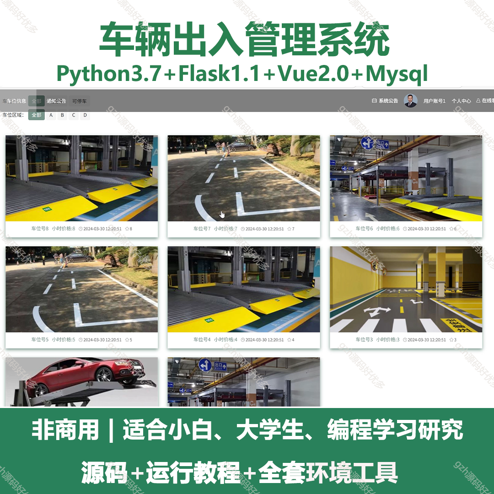
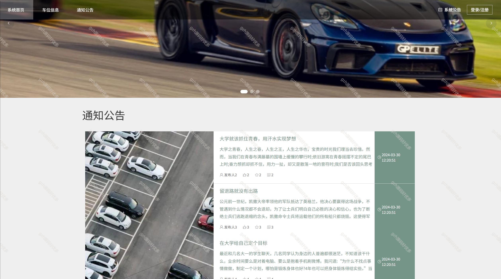
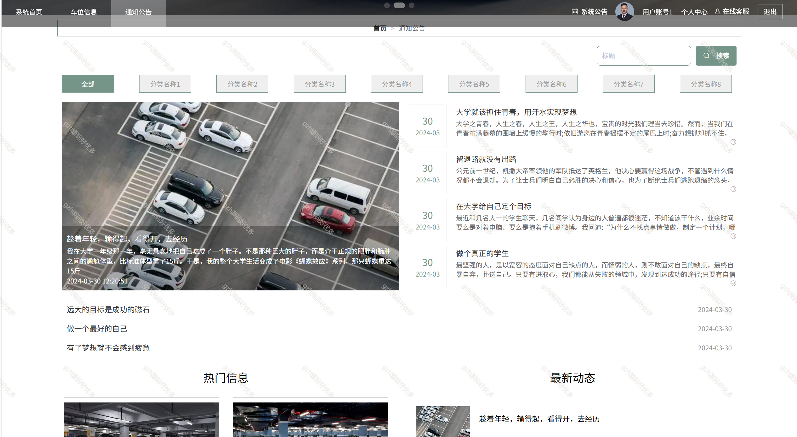
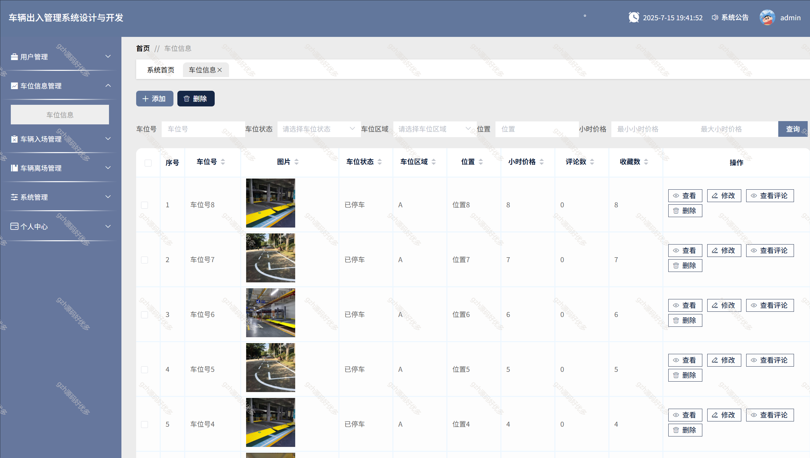
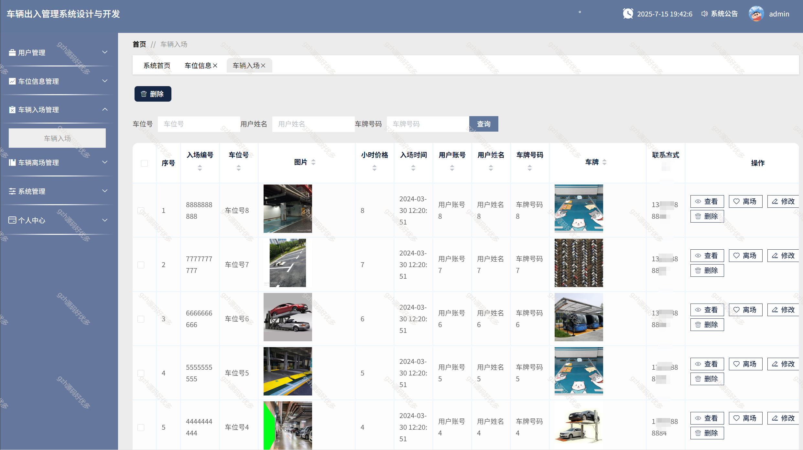
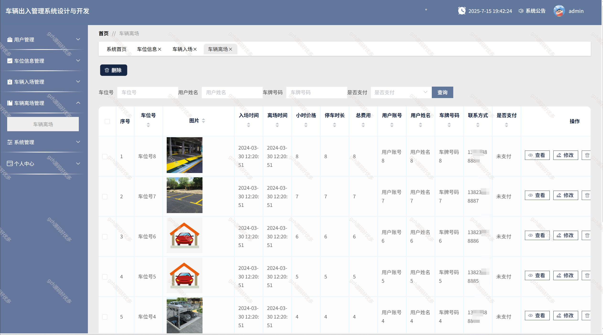
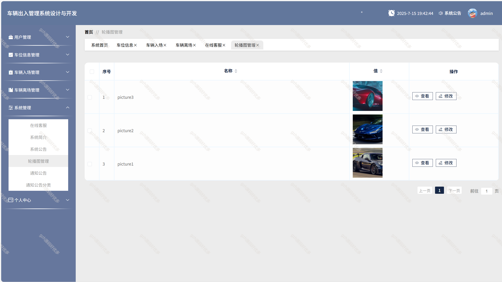

# python052
python052基于Python+Flask的车辆出入管理系统
 
## 查看主页获取源码

### 一、关键词
车辆出入系统、车辆出入管理系统

### 二、作品包含
源码+数据库+全套环境和工具资源+本地部署教程

### 三、项目技术
前端技术：Vue2.0、Element-ui
后端技术：Python3.7、Flask

### 四、运行环境（以下版本亲测，其他版本兼容性请自行测试）
开发工具：PyCharm + VSCODE

数据库：MySQL5.7（最低要5.7版本）

数据库管理工具：Navicat10+

Python：Python3.7

前端Nodejs：14

浏览器：谷歌浏览器

### 五、项目介绍
项目编号：python052

车辆出入系统是集用户管理、车位信息管理、车辆入场与离场精细化管控，以及系统公告、在线客服、轮播图管理等功能于一体，实现车辆有序高效出入，保障区域安全与通行秩序的数字化管理平台。

车辆出入管理系统具备用户管理、车位信息管理、车辆入场离场管理，以及系统管理（含在线客服、系统简介、公告、轮播图等配置 ）和个人中心功能，实现车辆出入全流程数字化管控 

### 六、运行截图

